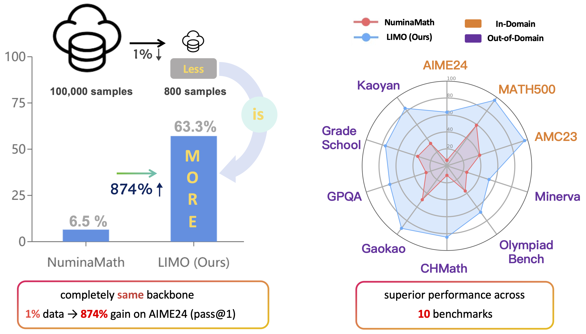

# LIMO: Less Is More for Reasoning 🚀

<div align="center">

[](https://arxiv.org/abs/)
[](https://opensource.org/licenses/MIT)
[](https://github.com/GAIR-NLP/LIMO)

*An efficient approach for mathematical reasoning with minimal but high-quality training data*
</div>



## 📌 Table of Contents
- [Overview](#overview)
- [Key Results](#key-results)
- [Model Zoo](#model-zoo)
- [Datasets](#datasets)
- [Quick Start](#quick-start)
- [Training](#training)
- [Evaluation](#evaluation)
- [Citation](#citation)


## Overview

LIMO challenges the conventional wisdom in mathematical reasoning by demonstrating that models can achieve superior performance with significantly less but higher quality training data. Our approach:

- 🎯 Achieves SOTA with only 817 carefully curated training samples
- 🌟 Shows strong generalization across diverse problem types
- 🔬 Provides comprehensive evaluation on 10 benchmarks
- 📚 Releases high-quality datasets and evaluation tools

## Key Results

| Model | AIME24 | MATH500 | Training Samples |
|-------|--------|---------|-----------------|
| LIMO (Ours) | **57.1%** | **94.8%** | 817 |
| Previous SOTA | 6.5% | 59.2% | 100k+ |

<details>
<summary>Click to see more detailed results</summary>

| Benchmark | LIMO | Previous SOTA | Improvement |
|-----------|------|--------------------------|-------------|
| AIME24 | **57.1%** | 6.5% | +50.6% |
| MATH500 | **94.8%** | 59.2% | +35.6% |
| AMC23 | **92.0%** | 40.6% | +51.4% |
| OlympiadBench | **66.8%** | 36.7% | +30.1% |
| CHMath | **75.4%** | 11.2% | +64.2% |
| Gaokao | **81.0%** | 49.4% | +31.6% |
| Kaoyan | **73.4%** | 32.7% | +40.7% |
| GradeSchool | **76.2%** | 36.2% | +40.0% |
| Minerva | 44.9% | **47.1%** | -2.2% |
| GPQA | 66.7% | **73.3%** | -6.6% |

</details>

## Model Zoo

Our LIMO model is available on Hugging Face 🤗:

| Model | Backbone | Size | Link |
|-------|------|------|------|
| LIMO | [Qwen2.5-32B-Instruct](https://huggingface.co/Qwen/Qwen2.5-32B-Instruct)  | 32B | [🤗](https://huggingface.co/GAIR/LIMO) |


## Datasets

We release our datasets through Hugging Face 🤗:

| Dataset | Description | Size | Link |
|---------|-------------|------|------|
| `LIMO` | Training set used to train LIMO model | 817 | [🤗](https://huggingface.co/datasets/GAIR/LIMO) |

Note: We are gradually releasing additional datasets mentioned in our paper, including those used for comparative experiments, to facilitate reproducibility and further analysis by the research community. Stay tuned!

## Quick Start

Our model is fine-tuned on [Qwen2.5-32B-Instruct](https://huggingface.co/Qwen/Qwen2.5-32B-Instruct) and is compatible with most mainstream frameworks like [HF Transformers](https://github.com/huggingface/transformers), [VLLM](https://github.com/vllm-project/vllm), [TensorRT-LLM](https://github.com/NVIDIA/TensorRT-LLM) and etc. For inference, we use 4× H100 80GB GPUs (tested to work with a minimum of 2× H100 GPUs).


<details>
<summary>Start with HF Transformers</summary>

```bash
# Install required packages
pip install transformers
```

```python
from transformers import AutoModelForCausalLM, AutoTokenizer
import torch

# Initialize model and tokenizer
model = AutoModelForCausalLM.from_pretrained(
    "GAIR/LIMO",
    torch_dtype="auto",
    trust_remote_code=True,
    device_map="auto"
)
tokenizer = AutoTokenizer.from_pretrained("GAIR/LIMO", trust_remote_code=True)

# Prepare input messages (We use the following template and system prompt during training and inference)
messages = [
    {"role": "system", "content": "Please reason step by step, and put your final answer within \\boxed{}."},
    {"role": "user", "content": "What is the result of 1+1?"}
]

# Format input using chat template
text = tokenizer.apply_chat_template(
    messages,
    tokenize=False,
    add_generation_prompt=True
)

# Tokenize input
inputs = tokenizer(text, return_tensors="pt").to(model.device)

# Generate response
outputs = model.generate(
    **inputs,
    max_new_tokens=32768,
    temperature=0.7,
    top_p=0.95,
    do_sample=True
)

# Decode and print response
response = tokenizer.decode(outputs[0][inputs['input_ids'].shape[1]:], skip_special_tokens=True)
print(response)
```

</details>

<details>
<summary>Start with VLLM</summary>

```bash
# Install required packages
pip install vllm
```


```python
from vllm import LLM, SamplingParams
from transformers import AutoTokenizer

# Initialize the model
llm = LLM(
    model="GAIR/LIMO",
    tensor_parallel_size=4,  # adjust based on available GPUs
    trust_remote_code=True,
    swap_space=60,
    gpu_memory_utilization=0.96,
)

# Prepare input messages (We use the following template and system prompt during training and inference)
messages = [
    {"role": "system", "content": "Please reason step by step, and put your final answer within \\boxed{}."},
    {"role": "user", "content": "What is the result of 1+1?"}
]

# Setup tokenizer
tokenizer = AutoTokenizer.from_pretrained("GAIR/LIMO", trust_remote_code=True)
text = tokenizer.apply_chat_template(
    messages,
    tokenize=False,
    add_generation_prompt=True
)

# Configure generation parameters
sampling_params = SamplingParams(
    temperature=0.7,
    max_tokens=32768,
    top_p=0.95,
)

# Generate response
output = llm.generate(text, sampling_params)
print(output[0].outputs[0].text)
```

</details>


## Training

We utilize [LLaMA-Factory](https://github.com/hiyouga/LLaMA-Factory) framework for training, which provides a convenient and efficient training pipeline. Our training setup used 32× H100 80GB GPUs.

To reproduce our training process:

- Set up LLaMA-Factory following their official [documentation](https://github.com/hiyouga/LLaMA-Factory#installation).

- Prepare the LIMO dataset from [🤗](https://huggingface.co/datasets/GAIR/LIMO) and format it according to LLaMA-Factory's [data preparation guidelines](https://github.com/hiyouga/LLaMA-Factory/tree/main/data).

- Use our provided configuration file at [`./train/train_limo.yaml`](./train/train_limo.yaml).

- Launch training with LLaMA-Factory using our config according to [LLaMA-Factory's official training examples](https://github.com/hiyouga/LLaMA-Factory/blob/main/examples/README.md).

## Evaluation

We also release scripts for evaluating Large Language Models (LLMs) on mathematical reasoning tasks. The evaluation framework includes both inference (using the VLLM framework) and evaluation (using both rule-based and model-based approaches) components.

For rule-based evaluation, we support pure numerical problems like AIME and most MATH problems. For more complex responses (expressions, equations, or natural language descriptions), we employ model-based evaluation using Qwen2.5-32B-Instruct as the judge model.

For detailed instructions and implementation details, please refer to [`eval/README.md`](./eval/README.md).


## License

This project is licensed under the MIT License - see the [LICENSE](LICENSE) file for details.


## Citation

```bibtex
@article{limo2024,
title={LIMO: Less is More for Mathematical Reasoning},
author={},
journal={arXiv preprint arXiv:},
year={2024}
}
```